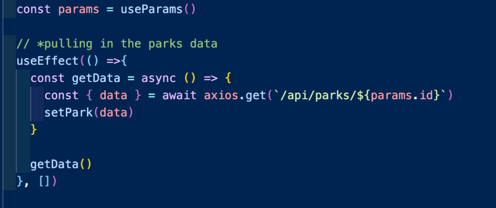
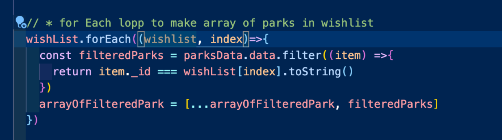

# Natural Wanderer

## Project Brief

In one week, build a full-stack app MERN app with CRUD functionality, working solo, in a pair, or in a group of three. I was in a group with Mike Edwards and Hannah Tinacci, all of whom have missed travel, nad have a love for the outdoors

## Link to Deployed Project
https://natural-wanderer.netlify.app/

## Overview and Concept
During lockdown we have had a lot of time to think about places to go, and fawn over national parks and wild spaces that people have been enjoying in their own backyard. The initial concept for the app was to build a clone of the UK National Parks website, focusing on what is in our own backyard! I am a huge advocate for the natural beauty in the uk, and take every opportunity to get out into the national parks. Soon after we started building out our wireframes however, we decided to expand the scope, and make the site into a more global site, and build in an almost trip-advisor like element with comments and recommendations for the park. The aesthetic for the site was to be clean, simple and easy to use, and in order to achieve this we settled on Semantic UI as our framework. 

## Technologies Used
* Node.js
* MongoDB
* Express
* React
* JavaScript
* CSS
* Semantic UI
* GitHub
* Heroku
* Netlify

## Approach Taken

The idea for the project came to us whilst we discussed our interests, and started to think up a theme for our project. We are all fond of travel, and I was keen to incorporate some natural/outdoorsy element to the project. Once we had settled on a project concept, we started to write our pseudocode, with post-MVP features listed in order of preference, and wireframes of design layout and user flow were made. We started a Trello for visibility, task assignment and assessment of priorities, and a Google Sheet for collecting information for our database. We outlined our models, and tried to plan out all of the models we would need to achieve the functionality we had planned. 

As soon as we had finished our planning we decided to tackle elements of the project individually. We split the work up by issuing tickets on Trello. This was a very efficient way to manage the workload, and as such we were able to get the backend finished quickly and helped us reach MVP ahead of schedule. During the day, we coded on our own sections, but stayed in a zoom room together to allow for quick consults if we hit a roadblock in our code. This was very beneficial, and allowed us to bounce ideas around if we got stuck. We had regular stand-ups as a group to merge the project together, and discuss any problems we had had, or any ideas to add to the project. I really enjoyed working in the team, and the level of independence was a  big benefit to this way of working. 

Once the backend was done, there were a few sections that I became responsible for, and these are the areas that I would work on during the day and in the evening when not adding to our seeds file, which ended up being a monumental job! 

The first page that I worked on was the park show page. This is where the information for an individual park was displayed. This page has several key pieces of functionality. Before I started working on the functionality of the page however it was important to get the information rendering for the correct parks. This was done by pulling information about the specific park from the database. In order to do this, I used params from ‘react-router-dom’ to access the ID of the park from the URL. This allowed me to make a get request using the park's unique ID so that the information populated related to the correct park. Once the information was pulled in, it was just a case of displaying the data on the page in the JSX, most of it did not even need to be mapped through before it could be displayed. 

We also wanted to be able to save parks to our profile  In order to be able to save a park to the wishlist, it was necessary to be able to send information to the wishlist, while not deleting what was already in the users wishlist. This involved spreading in the users current wishlist (passed through props to the wishlist component), adding in the current parks ID to the array of wishlist park ID’s, and then sending this data containing the old wishlist plus the new park back to the database using a ‘put’ request. There is also some conditional rendering on the save to wishlist button prompting the user to login if the are not logged in. 

My personal favourite feature on the park show page is probably the weather forecast widget. This app takes the location data that is in the database, and gets the weather from OpenWeather API, and renders it on the page. The weather app has the functionality of either today's weather or the 7-day forecast. This was relatively straightforward to implement. The OpenWeather documentation is very clear, and the dataset returned is massive. This allows for a huge degree of scope. What I really liked is the option to get the icons for the different weather conditions from the API, which meant that each weather condition has an appropriate image to go with it, and this was really easy to implement. Both the current and week weather functions were split into their own components, and received data through props for the specific parks latitude and longitude. The display of the data was just the case of mapping through the data returned from the API. 

The final piece to the puzzle for the page was the comments and recommendations. This started off as having separate pages for the comments and recommendations forms. After a discussion with the team we decided that the comments need to be able to be added from the page, but the recommendations form is too long to have on the page, so we went for a separate page for the recommendations from, and integrated the comments onto the page. There is conditional rendering on these components that remedy users to login in order to be able to add comments and recommendations. The gif below provides a demonstration for these components in action! 

The comments and recommendations forms have the ability to be edited and deleted, however only the owner of the comments and recommendations have the permissions to edit and delete their own comments. This option is hidden if the user does not own the comment or recommendation. 

There is one component on the show page that I was not responsible for. This is the map. The integration of the map to show the users location was added by Mike, and he and I worked together on implementing a map which allows you to plot a route on. The map feature adds a nice visualization of the location of the park, and allows users to visualise when each park is located. The plot a route function allows the user to plan a route using the draw feature, however there is not an option to export or save this route, as we ran out of time on the build. 

Because I was working closely with the park show page, it made sense that I developed the profile page as a key component of this page was the saved data in the wishlist- it made sense to develop these features together. The profile page is relatively simple- containing the users information, as well as a saved selection of parks that the user can add to, or remove from. There is also functionality to edit the user profile. 

The first thing to do on the profile page was to convert the wishlist into data for the parks. This was done by looping through the wishlist with a .forEach, and creating a new array of parks that match the parks on the wishlist. This data could then be displayed on the page. 

The biggest challenge on the profile page was the functionality to remove one park from the wishlist. This took several steps. First was to create a new wishlist using the .filter array method. This would return everything apart from the park with the event.target.value of the park to be removed (this would be the parks ID). This wishlist would then be pushed to the database replacing the pre-existing wishlist. 

The final component that I worked on were the forms for comments and recommendations, as well as the register and login forms. The most interesting feature in the forms was the ability to upload images. This was done by uploading images to cloudinary for hosting, and using the hosted URL to display the image that is returned. I created an ImageUploadField component that handles the majority of the functionality, and this allows me to re-use the component for both the recommendations and the register form. 

## Bugs, Blockers and Wins
### Known or suspected bugs
On the edit profile and recommendations forms, it is not possible to edit the images. 
The users that were added via the seeds file cannot login, only users who create their account though the site. 
### Blockers
Deployment. The majority of bugs we came across in the project, we were able to solve together with relatively little hassle. Deployment was a different story. We wanted to deploy the project through heroku for the front and backend, however after two days of trying, we scrapped this idea, and deployed the frontend with Netflify, and the backend with Heroku. This was a real struggle, and probably the hardest problem from the whole project 
### Wins
This was the first full stack application I had built, and the project was on a much larger scale that anything I have built before. Having a fantastic team who worked so well together was incredible, and truly rewarding. 
The project has turned out on the whole exactly how we had pictured it. The project works well, and all the features have turned out exactly as we wanted them. 

## Key Learning and Future Features:

Learning-wise, my biggest takeaway is the power of teamwork. Without Hannah and Mike, this project would have been substantially smaller and far less complex.  Working with a group of talented coders meant that one of us always had the answer to the others problems, and building out more complex components was much smoother. 

In terms of future features, on the whole the three of us are extremely happy with the end result; however, some additions could include:

* A social media aspect where users could comment on eachothers recommendations, follow each other and form an outdoors community 
* We wanted to add in a translation API for the different regions 
* More complete maps- so people can plot and save their routes
* PayPal integration with the donations on the homepage
* OAuth for login

